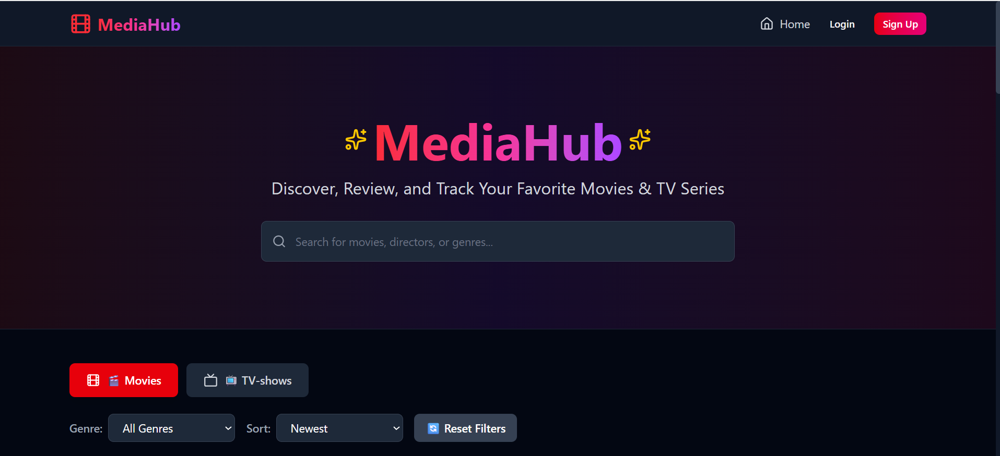
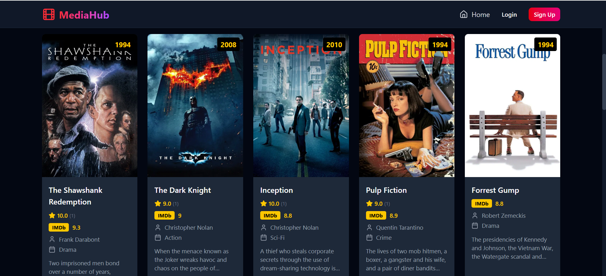
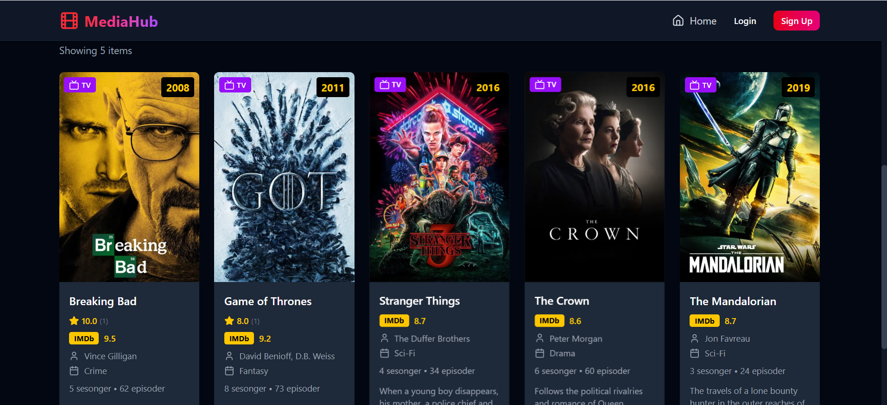
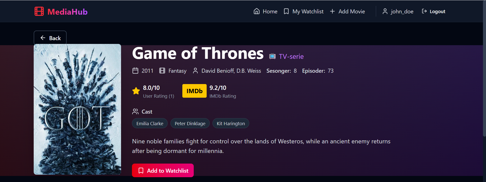
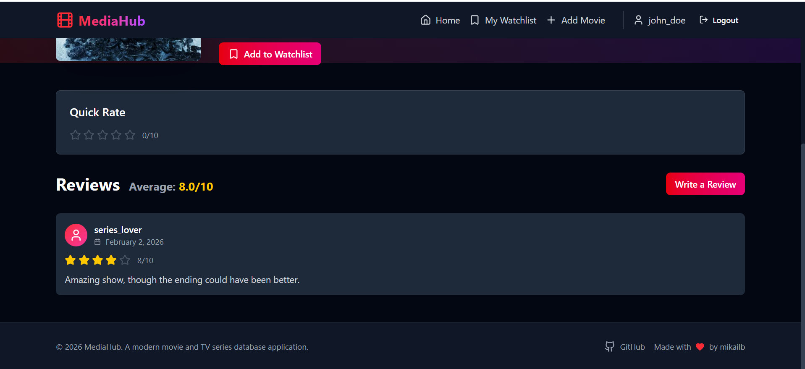
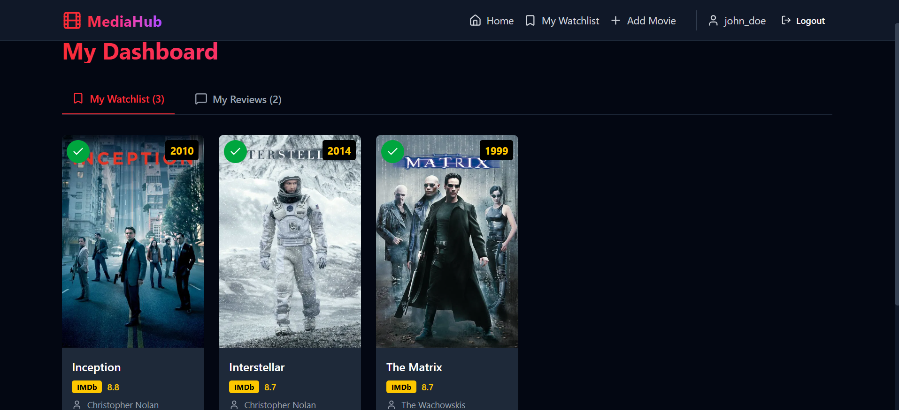
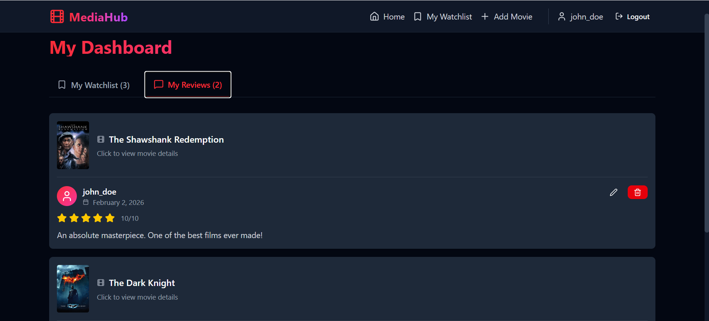
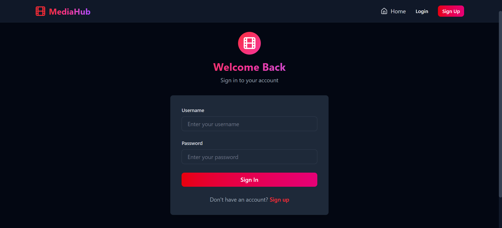

# MediaHub

A full-stack movie and TV series database application with user authentication, reviews, and watchlists.



## Features

- 🎬 Browse movies and TV series with posters and details
- ⭐ User reviews and ratings (1-10)
- 📋 Personal watchlist
- 🔐 JWT authentication
- 🔍 Search and filter content

## Screenshots

<details>
<summary>View Screenshots</summary>

### Home Page




### Movie Details



### Watchlist


### Reviews


### Login


</details>

## Tech Stack

**Backend:** Java 17, Spring Boot 4.0.2, Spring Security, JWT, PostgreSQL/H2

**Frontend:** React 18, Vite, Tailwind CSS, React Router v7, Axios

## Quick Start

### Backend
```bash
git clone https://github.com/mikailb/MediaHub.git
cd MediaHub
./gradlew bootRun --args='--spring.profiles.active=default-init'
```

### Frontend
```bash
cd frontend
npm install
npm run dev
```

**URLs:**
- Frontend: http://localhost:3000
- Backend API: http://localhost:8080
- Swagger UI: http://localhost:8080/swagger-ui.html

## Demo Accounts

| Username | Password |
|----------|----------|
| john_doe | password123 |
| movie_fan | password123 |
| cinephile | password123 |
| series_lover | password123 |

## API Endpoints

| Method | Endpoint | Description |
|--------|----------|-------------|
| POST | `/api/auth/register` | Register user |
| POST | `/api/auth/login` | Login |
| GET | `/api/movies` | Get all movies |
| GET | `/api/movies/{id}` | Get movie by ID |
| GET | `/api/movies/search?keyword=` | Search movies |
| POST | `/api/movies/{id}/reviews` | Add review |
| GET | `/api/watchlist` | Get watchlist |
| POST | `/api/watchlist/movies/{id}` | Add to watchlist |

## License

MIT License